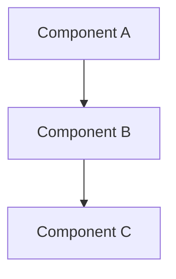

# ADR-0000: Architecture Decision Record Template

## Metadata

| Property | Value |
|---|---|
| **Status** | `Accepted` |
| **Date** | 2026-10-02 |
| **Authors** | Spectrayan Architecture Team (`architecture@spectrayan.com`) |
| **Deciders** | Carefold Core Maintainers |
| **Consulted** | Clinical AI Reviewers, Security Engineering Team |
| **Informed** | Carefold Open-Source Community |

---

## Context & Problem Statement

Describe the context and the problem being addressed. What situation prompted this decision? What challenges or architectural limitations exist in the current implementation?

Include relevant background constraints (e.g. performance, regulatory compliance, HIPAA privacy, memory footprint).

---

## Decision Drivers

List the key criteria that guide this architectural choice:
- **Driver 1**: [e.g. Local-first zero telemetry execution]
- **Driver 2**: [e.g. Decoupling specialist personas from operational plumbing]
- **Driver 3**: [e.g. Deterministic clinical safety boundaries]
- **Driver 4**: [e.g. Sub-second routing latency across 50+ specialist agents]

---

## Considered Options

### Option 1: [Name of First Option]
* **Description**: Brief explanation of how this approach works.
* **Pros**:
  - Direct, simple to implement.
  - Minimal initial development overhead.
* **Cons**:
  - Poor scalability as agent catalog expands.
  - Tightly couples disparate layers.

### Option 2: [Name of Second Option]
* **Description**: Brief explanation of how this approach works.
* **Pros**:
  - Strong architectural isolation.
* **Cons**:
  - High operational complexity; requires external daemon.

### Option 3: [Name of Third Option (Chosen)]
* **Description**: Brief explanation of the selected approach.
* **Pros**:
  - Addresses all core decision drivers.
  - Clean boundary isolation with zero external runtime dependencies.
* **Cons**:
  - Requires authoring adapter interfaces and validation tests.

---

## Decision Outcome

**Chosen Option**: **Option 3: [Title of Chosen Option]**

### Justification
Explain why this option was selected over the alternatives. How does it balance the decision drivers and trade-offs?

### Architectural Diagram



---

## Consequences

### Positive Consequences
- [Advantage 1 achieved by this decision]
- [Advantage 2 achieved by this decision]

### Negative Consequences
- [Accepted trade-off or added complexity]

### Neutral / Preserved Behaviors
- [Existing interfaces or workflows that remain backward compatible]

---

## Verification & Code References

Detail the exact files, modules, and commands used to verify this decision:

- **Core Implementation**: `path/to/source/file.py`
- **Port Interfaces**: `path/to/ports/interface.py`
- **Unit & Integration Tests**: `path/to/tests/test_file.py`
- **Verification Command**:
  ```bash
  backend/.venv/bin/pytest path/to/tests/test_file.py
  ```
