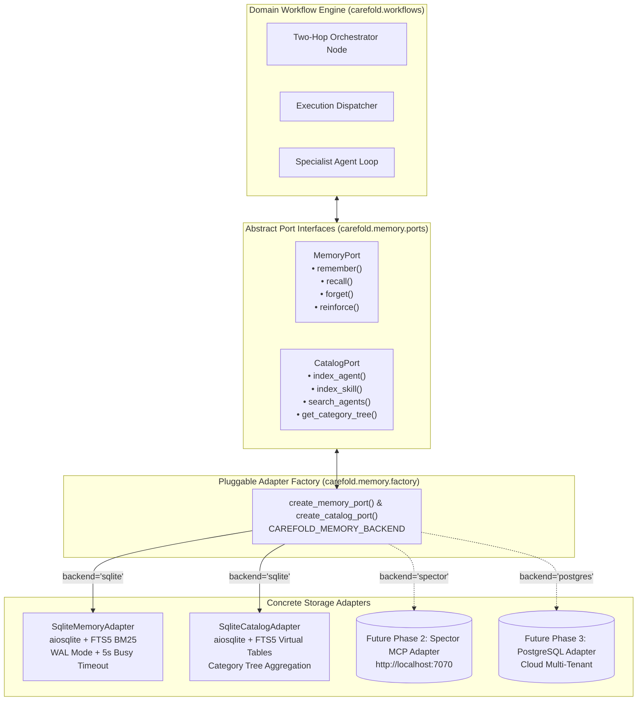

# ADR-0002: Hexagonal Memory and Catalog Ports Architecture

## Metadata

| Property | Value |
|---|---|
| **Status** | `Accepted (Implemented)` |
| **Date** | 2026-10-02 |
| **Authors** | Spectrayan Architecture Team (`architecture@spectrayan.com`) |
| **Deciders** | Carefold Core Maintainers, Systems Architect |
| **Consulted** | Database Engineering Team, Security Engineering Lead |
| **Informed** | Carefold Open-Source Community |

---

## Context & Problem Statement

Healthcare AI runtime environments require rich, long-term memory and low-latency discovery:
1. **Multi-Tier Cognitive Memory**: Consultation workflows require different retention semantics: ephemeral working scratchpads, chronological conversation logs, persistent patient clinical facts, and static procedural medical guidelines.
2. **Searchable Agent & Skill Discovery**: The orchestrator and marketplace require sub-millisecond full-text keyword indexing and taxonomy tree aggregation across 20+ agents and 20+ skill manifests.
3. **Local-First Zero-Dependency Constraint**: Carefold must run locally on developer workstations and privacy-sensitive healthcare clinics without requiring heavy external database services, Docker daemons, or cloud vector store accounts.
4. **Future Roadmap Extensibility**: The storage layer must provide a clean extension point to connect to enterprise persistent memory (such as Spector MCP in Phase 2) or managed cloud databases (PostgreSQL in Phase 3) without modifying workflow or agent code.

---

## Decision Drivers

- **Hexagonal Isolation**: Abstract ports must isolate domain workflows from concrete storage implementations.
- **Cognitive Fidelity**: Support four distinct cognitive memory tiers (`WORKING`, `EPISODIC`, `SEMANTIC`, `PROCEDURAL`) with salience decay and reinforcement.
- **Zero-Dependency Local Run**: Default deployment must operate entirely in-process using SQLite FTS5.
- **Concurrency & Locking Resiliency**: Provide robust write-ahead logging (WAL), busy timeouts, and exponential backoff retry to prevent SQLite database locks.
- **Pluggable Factory**: Allow swapping storage backends via simple configuration (`CAREFOLD_MEMORY_BACKEND`).

---

## Considered Options

### Option 1: Direct SQLite Calls Inside Workflow Nodes
* **Description**: Write raw SQL queries directly inside `OrchestratorNode` and `AgentExecutionNode`.
* **Pros**: Rapid initial prototyping.
* **Cons**: Tight coupling between business logic and database schema; impossible to swap backends for Spector or Postgres; high risk of lock contention across asynchronous nodes.

### Option 2: Heavyweight Vector Database Requirement (e.g. Chroma / Qdrant)
* **Description**: Require an external vector database process for agent discovery and memory embeddings.
* **Pros**: Semantic vector similarity search.
* **Cons**: Violates the zero-dependency local-first principle; requires installing C++ binaries or external Docker containers; heavy memory footprint; unnecessary for keyword-driven clinical protocol matching.

### Option 3: Hexagonal Ports-and-Adapters with SQLite FTS5 Default (Selected)
* **Description**: Define clean abstract ports (`MemoryPort`, `CatalogPort`) and implement high-performance default adapters using `aiosqlite` and SQLite FTS5 with BM25 ranking. Provide factory hooks for Spector MCP and PostgreSQL backends.
* **Pros**:
  - Zero external dependencies—runs seamlessly on any Python 3.12+ environment.
  - Sub-millisecond FTS5 BM25 search over titles, descriptions, and personas.
  - 4-tier cognitive memory architecture with salience scoring and reinforcement.
  - WAL journal mode, 10000ms busy timeout, and write retry backoff guarantee concurrency safety.
  - Clear architectural path for Phase 2 Spector MCP and Phase 3 PostgreSQL integration.
* **Cons**: None for local deployments.

---

## Decision Outcome

**Chosen Option**: **Option 3: Hexagonal Ports-and-Adapters with SQLite FTS5 Default**

We introduced the hexagonal persistence architecture located in `backend/src/carefold/memory/`.

### Architecture & Port Mapping Diagram

---

## Implementation Details

### 1. MemoryPort & Cognitive Tiers
`MemoryTier(str, Enum)` defines:
- `WORKING = "working"`
- `EPISODIC = "episodic"`
- `SEMANTIC = "semantic"`
- `PROCEDURAL = "procedural"`

`MemoryPort` defines abstract coroutines:
- `remember(key, value, tier, namespace, metadata)`
- `recall(query, tier, namespace, limit)`
- `forget(key, namespace)`
- `reinforce(key, namespace, delta)`

### 2. CatalogPort & Taxonomy Discovery
`CatalogPort` defines abstract coroutines:
- `index_agent(manifest)`
- `index_skill(manifest)`
- `search_agents(query, domain, category, limit)`
- `search_skills(query, domain, category, limit)`
- `get_category_tree()`

### 3. Concrete SQLite Adapters
- **`SqliteMemoryAdapter`**:
  - Relational `memories` table with composite primary key `(namespace, key)` and salience indexing.
  - Virtual table `memories_fts USING fts5(id UNINDEXED, namespace UNINDEXED, content, tokenize = 'porter unicode61')`.
  - Transaction safety: WAL mode (`PRAGMA journal_mode = WAL;`), busy timeout (`PRAGMA busy_timeout = 10000;`), and `_run_write_with_retry` exponential backoff.
- **`SqliteCatalogAdapter`**:
  - Indexed tables `agents` and `skills`.
  - Virtual tables `agents_fts` and `skills_fts`.
  - Taxonomy Tree Aggregator: `build_category_tree_from_rows` aggregates counts across domains (`clinical`, `therapy`, `wellness`, `navigation`, `education`).

### 4. Pluggable Factory Strategy (`factory.py`)
- Defines `SUPPORTED_MEMORY_BACKENDS = frozenset({'sqlite', 'spector', 'postgres'})`.
- Instantiates `SqliteMemoryAdapter` and `SqliteCatalogAdapter` when `CAREFOLD_MEMORY_BACKEND == "sqlite"`.
- Explicitly raises `NotImplementedError` for `'spector'` and `'postgres'` backends, designating them as documented extension points for Phase 2 and Phase 3 roadmap milestones.

---

## Consequences

### Positive Consequences
- **True Zero-Dependency Execution**: Developers and end-users can run the full system immediately upon cloning without database setup.
- **Deterministic Search**: FTS5 BM25 search provides exact keyword matching and morphological stemming (`porter unicode61`) without vector embedding costs.
- **High Concurrency Stability**: The combination of WAL mode, 10000ms busy timeout, and write retry loops completely eliminates database lock errors during concurrent requests.
- **Clean Decoupling**: Business logic in `carefold/workflows/` has zero dependencies on SQLite.

### Negative Consequences
- **Semantic Synonym Limitations**: FTS5 relies on token matching and stemming rather than deep neural semantic vector embeddings (which will be unlocked by Phase 2 Spector integration).

---

## Verification & Code References

| Component | Code Reference | Test Suite |
|---|---|---|
| Memory Port Interface | `backend/src/carefold/memory/ports/memory_port.py` | `backend/tests/test_memory_port.py` |
| Catalog Port Interface | `backend/src/carefold/memory/ports/catalog_port.py` | `backend/tests/test_catalog_port.py` |
| SQLite Memory Adapter | `backend/src/carefold/memory/adapters/sqlite/memory_adapter.py` | `backend/tests/test_sqlite_memory_adapter.py` |
| SQLite Catalog Adapter | `backend/src/carefold/memory/adapters/sqlite/catalog_adapter.py` | `backend/tests/test_sqlite_catalog_adapter.py` |
| Pluggable Factory | `backend/src/carefold/memory/factory.py` | `backend/tests/test_memory_factory.py` |
