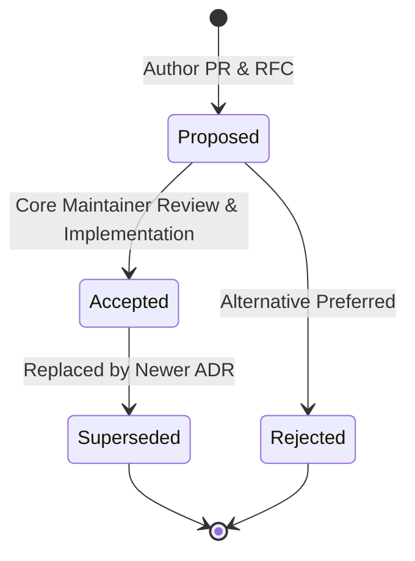

# Architecture Decision Records (ADRs)

Carefold uses **Architecture Decision Records (ADRs)** to document significant architectural, design, and structural decisions made throughout the evolution of the platform.

Our ADR system is modeled after the **Spector Living ADR Framework**, ensuring that all architectural choices are transparent, historical, and directly verified against working code.

---

## ADR Lifecycle & Statuses

Every ADR moves through a structured lifecycle:

| Status | Definition |
|---|---|
| **`Proposed`** | The decision is under active review by maintainers and clinical AI reviewers. |
| **`Accepted (Implemented)`** | The decision has been approved, merged, and fully verified against production code. |
| **`Superseded`** | A subsequent ADR has replaced or significantly amended this decision (links to newer ADR). |
| **`Rejected`** | The proposal was evaluated but not adopted. Retained for historical record. |

---

## Immutability & Contribution Rules

1. **Historical Immutability**: Once an ADR is marked `Accepted (Implemented)`, its original problem statement, evaluated options, and trade-off analysis must never be rewritten.
2. **Amending Decisions**: If an architectural requirement changes, do not edit the accepted ADR. Instead, author a new ADR (e.g., `0003-...md`) that explicitly marks the earlier record as `Superseded by ADR-0003`.
3. **Template Compliance**: All new proposals must start from [`0000-template.md`](0000-template.md) and include:
   - Metadata table (Date, Authors, Status, Deciders).
   - Decision Drivers.
   - Considered Options with pros/cons.
   - Decision Outcome.
   - Consequences (Positive, Negative, Neutral).
   - Code verification references.

---

## ADR Index

| ADR # | Title | Status | Date | Primary Code References |
|---|---|---|---|---|
| **[0000](0000-template.md)** | Architecture Decision Record Template | `Accepted` | 2026-10-02 | — |
| **[0001](0001-orchestrator-driven-agent-architecture.md)** | Orchestrator-Driven Multi-Agent Architecture | `Accepted (Implemented)` | 2026-10-02 | `carefold/workflows/`, `carefold/loaders/`, `carefold/safety/` |
| **[0002](0002-hexagonal-memory-and-catalog-ports.md)** | Hexagonal Memory & Catalog Ports Architecture | `Accepted (Implemented)` | 2026-10-02 | `carefold/memory/ports/`, `carefold/memory/adapters/sqlite/` |
