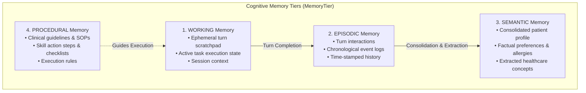
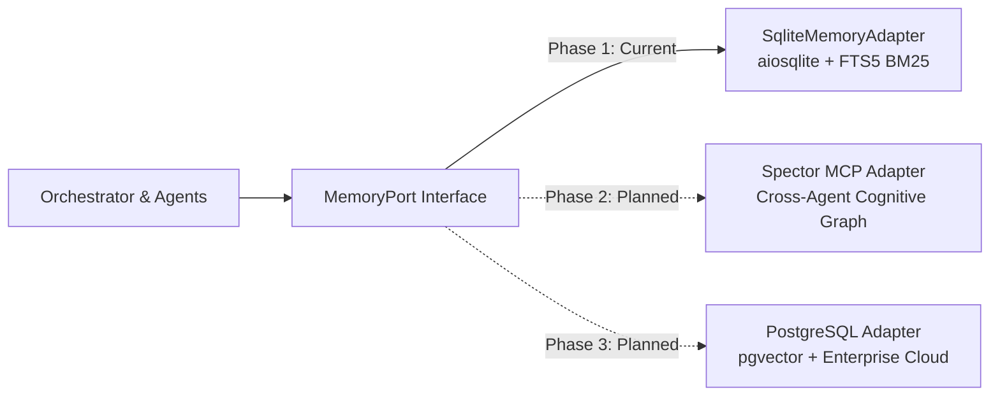

# Cognitive Memory & Spector Architecture

Carefold adopts a bio-inspired cognitive memory architecture modeled on Spector standards. Rather than treating memory as an undifferentiated vector blob or a flat chat history, Carefold segments agent recollection into **four hierarchical cognitive tiers** with active salience decay and reinforcement.

---

## The 4 Cognitive Memory Tiers

The cognitive tiers represent distinct temporal longevities, mutabilities, and cognitive responsibilities:

### 1. `WORKING` Memory (`MemoryTier.WORKING`)
- **Longevity**: Ephemeral (turn or session lifecycle).
- **Function**: Active reasoning scratchpad, current tool outputs, intermediate Pydantic extraction state, and execution plan variables.
- **Eviction**: Cleared upon turn completion or session teardown.

### 2. `EPISODIC` Memory (`MemoryTier.EPISODIC`)
- **Longevity**: Medium-to-long term.
- **Function**: Autobiographical consultation history, verbatim user requests, specialist responses, and tool call traces with ISO timestamps.
- **Retrieval**: Queried for dialogue continuity and context recovery across multi-turn sessions.

### 3. `SEMANTIC` Memory (`MemoryTier.SEMANTIC`)
- **Longevity**: Persistent.
- **Function**: Structured factual knowledge extracted from patient interactions—chronic conditions, medication lists, preferred appointment times, communication preferences, and insurance coverage specifics.
- **Consolidation**: Populated via background extraction from episodic turns and attachment dossiers.

### 4. `PROCEDURAL` Memory (`MemoryTier.PROCEDURAL`)
- **Longevity**: Static / Versioned.
- **Function**: Standard operating procedures, clinical checklists, decision-tree rules, and triage guidelines declared in skill packages.

---

## Salience Scoring & Cognitive Decay

Not all memories possess equal relevance over time. Carefold implements salience scoring and decay:

1. **Initial Salience**: Memories are stored with a default `salience = 1.0` and `access_count = 0`.
2. **Access Tracking**: Every successful retrieval updates `access_count += 1` and refreshes `last_accessed_at`.
3. **Reinforcement**: When a user or specialist validates an extracted fact or rule, the orchestrator invokes `reinforce(key, namespace, delta=0.2)` to boost retrieval priority.
4. **Decay**: Memories that remain unaccessed experience decay during maintenance cycles, reducing their prominence in BM25 ranking.

---

## Spector Connectivity & Multi-Phase Roadmap

Persistence operations in Carefold are mediated through the hexagonal `MemoryPort` interface. The runtime supports three architectural backends:

### Backend Strategy (`backend/src/carefold/memory/factory.py`)

- **`sqlite` (Current Production Default)**:
  Zero-dependency, local-first storage using `aiosqlite` and SQLite FTS5. Fully ACID compliant with WAL mode (`PRAGMA journal_mode = WAL;`) and exponential backoff retry.
- **`spector` (Phase 2 Roadmap)**:
  Connects to Spector's Model Context Protocol (MCP) daemon on `http://localhost:7070`. Enables durable cross-agent shared episodic graphs and federated memory synchronization.
- **`postgres` (Phase 3 Roadmap)**:
  Targeted for enterprise multi-tenant deployments requiring horizontal scaling, row-level security, and cloud PostgreSQL databases.
