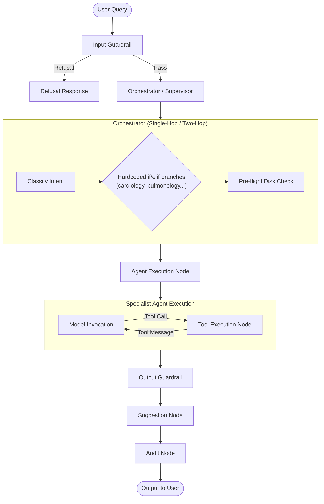
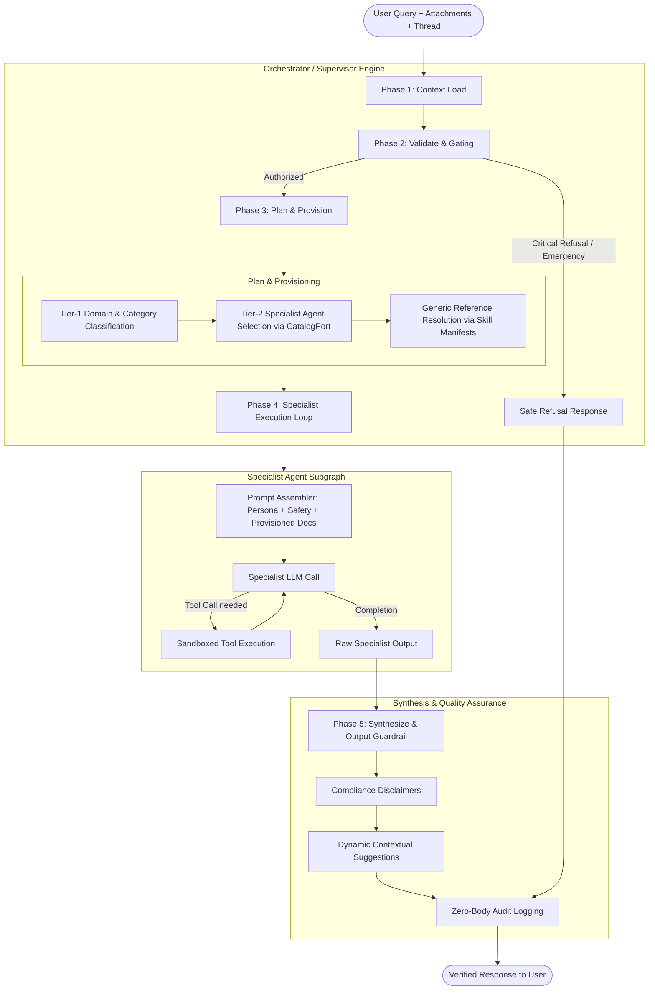

# Orchestrator-Driven Multi-Agent Workflow Architecture & Hardening Plan

## 1. Executive Summary & Design Vision

Carefold's core promise is to provide high-empathy, organ-specific clinical navigation and healthcare administrative stewardship while maintaining strict non-clinical safety boundaries.

Currently, individual agent personas risk becoming contaminated with operational plumbing—such as specific tool IDs (`skill_id="cardiology-prep"`), exact document filenames (`hypertension_log_template.md`), and filesystem calling syntax. Furthermore, the existing `OrchestratorNode` contains hardcoded `if/elif` branches for each specialty, and the workflow lacks an explicit synthesis/post-processing stage.

This proposal establishes a **pure Orchestrator-Driven Architecture**:
1. **Agent Personas are pure domain specialists**: They define clinical focus, communication empathy, interview methodologies, and emergency red flags. They are completely decoupled from filesystem paths and tool invocation syntax.
2. **The Orchestrator is the Central Conductor**: It executes a 5-phase lifecycle:
   $$\text{Context Load} \longrightarrow \text{Validate} \longrightarrow \text{Plan \& Provision} \longrightarrow \text{Execute Specialist(s) [Loop]} \longrightarrow \text{Synthesize \& Guard}$$
3. **Generic Reference Provisioning**: Replaces hardcoded Python `if/elif` chains in `OrchestratorNode` with catalog-driven and manifest-driven reference resolution.
4. **Unified Template Assembly**: Consolidates prompt rendering so that declared skills and orchestrator-provisioned reference documents are automatically injected into the specialist's context.

---

## 2. Current Architecture vs. Proposed Target Architecture

### Current Workflow Architecture (Fragmented)



#### Key Flaws in Current Design:
1. **Persona Contamination**: Specialist agents were being instructed in `persona.md` how to call `skill-docs` with exact filenames.
2. **Hardcoded Specialty Dispatch**: `orchestrator_node.py` (lines 524–564) explicitly checks `elif "cardiology-prep" in agent_skill_ids: req_docs.append("hypertension_log_template.md")`. This does not scale to 200+ agents.
3. **Unfed Provisioned Context**: Even when the orchestrator pre-flights reference documents, it does not inject their structured markdown content into the specialist agent's prompt context. The agent must make a separate tool call to read what the orchestrator already knew it needed.
4. **Prompt Divergence**: Two different Handlebars templates exist (`system_prompt.hbs` and `agent_execution_prompt.hbs`), with different variable names and missing declared skills in the latter.

---

### Proposed Target Architecture: Unified 5-Phase Orchestrator Lifecycle



---

## 3. Detailed Phase Breakdown

### Phase 1: Context Load
* **Input**: User prompt, conversation thread history, attached documents (`attachments/`), user notes (`notes/`), and user profile/state.
* **Responsibilities**:
  1. Retrieve chat history across the session checkpoint.
  2. Parse any attached text/PDF files and extract document summaries/dossiers.
  3. Load catalog indices from `CatalogPort` (SQLite FTS5).

### Phase 2: Validate & Safety Gating
* **Responsibilities**:
  1. **Input Guardrail**: Classify input against safety refusal boundaries (`check_safety_refusal`).
  2. **Emergency Red-Flag Detection**: If crushing chest pain, anaphylaxis, or acute stroke symptoms are detected, trigger immediate emergency referral (911/ER) without executing specialist workflows.
  3. **Risk-Class Authorization**: Check if the requested/implied agent requires `clinical_assist` and verify whether `allow_clinical` flag is active.

### Phase 3: Plan & Generic Provisioning
* **Tier-1 / Tier-2 Two-Hop Routing**:
  - Tier-1: Domain classifier narrows query to domain (`clinical`, `navigation`, `wellness`, `therapy`, `education`).
  - Tier-2: `CatalogPort` queries agents matching domain/category and picks the single best specialist (e.g. `cardiology-guide`).
* **Generic Reference Provisioning (Zero Hardcoding)**:
  - Inspect the selected agent's declared skills (e.g. `cardiology-prep`).
  - Retrieve the skill's declared reference documents from its manifest (`SkillManifest.references`).
  - Evaluate document relevance against the user prompt:
    - Match keywords from the reference document's title and description.
    - If a matching reference exists (e.g. `cardiology_visit_agenda.md`, `hypertension_log_template.md`), load the document content into `state["provisioned_references"]`.
  - If a declared skill or reference is missing on disk, invoke `SkillGeneratorNode` in-memory to synthesize it before handoff.

### Phase 4: Specialist Execution Loop
* **Context Hand-Off**:
  - The orchestrator hands off execution to the chosen specialist agent.
  - The specialist agent prompt is assembled with:
    1. Safety preamble & non-clinical boundaries.
    2. Agent Persona (clinical scope, empathy, communication protocol).
    3. Specific Orchestrator instructions (intent context, focus areas).
    4. **Pre-Provisioned Reference Material**: All relevant checklists, logging templates, and protocols are injected directly into the prompt context under `# PROVISIONED CLINICAL REFERENCES`.
* **Bounded Tool Execution**:
  - The specialist agent can interact with tools (`workspace-note`, `attach-read`, `skill-docs`) in a loop bounded by `max_tool_iterations` (default 3–5).
  - Because references are pre-provisioned, the specialist already possesses the necessary knowledge and rarely needs redundant `skill-docs` reads, but if called, the tool resolves instantly.

### Phase 5: Synthesize & Output Guardrail
* **Responsibilities**:
  1. **Synthesis / Review**: Validate that the specialist answered the user's inquiry, adhered to non-clinical boundaries, and omitted diagnostic assertions.
  2. **Quality Review**: Optionally run `quality-reviewer` or clinical tone check if high-risk.
  3. **Disclaimers**: Attach mandatory clinical disclaimer (`*Disclaimer: ...*`).
  4. **Dynamic AI Follow-Up Suggestions**: Generate 2–3 contextual, turn-aware follow-up question chips via `SuggestionNode`.
  5. **Audit Logging**: Write zero-body audit events to `audit.jsonl`.

---

## 4. Persona Purity Contract

To prevent architectural drift, all agent definitions must adhere to the **Persona Purity Contract**:

| Content Type | Belongs In | MUST NOT Contain |
| :--- | :--- | :--- |
| **Agent Persona** (`persona.md`) | Clinical focus, communication tone, patient interview protocol, non-clinical boundaries, red-flag triggers | Low-level tool calling syntax, skill IDs (e.g. `cardiology-prep`), document filenames (e.g. `hypertension_log_template.md`), filesystem paths |
| **Agent Manifest** (`agent.yaml`) | Agent ID, title, domain, category, care stages, tags, risk class, declared skill IDs, declared tool names | Execution logic, inline prompt templates |
| **Skill Definition** (`SKILL.md` + `references/`) | Skill scope, 3 mandatory intended-use lines, markdown reference templates, logging forms, checklists | Agent routing logic, orchestrator controls |
| **Orchestrator** (`orchestrator_node.py`) | Context loading, intent classification, catalog routing, generic skill/doc provisioning, multi-agent dispatch, response synthesis | Hardcoded specialty names (no `elif "cardiology-prep" in ...`), hardcoded document names |

---

## 5. Technical Implementation Plan

### Step 1: Purify Agent Personas
* Revert explicit tool invocation directives in `agents/cardiology-guide/persona.md` and any other agent personas.
* Ensure personas focus 100% on clinical domain guidance, patient coaching, and safety boundaries.

### Step 2: Generic Reference Provisioning in `OrchestratorNode`
* Replace the hardcoded `if/elif` chain in `OrchestratorNode._preflight_prepare_skills_and_docs` (lines 523–564) with a generic, data-driven matcher:
  ```python
  # Generic provisioning: inspect all declared skills of target agent
  for skill_id in (manifest.skills or []):
      skill = self.registry.get_skill(skill_id)
      if not skill:
          continue
      # Match prompt tokens against skill references and doc metadata
      for ref_doc in (skill.references or []):
          if self._is_reference_relevant(ref_doc, prompt_text, skill):
              req_docs.append(ref_doc)
  ```
* Read and load matched reference documents into a new state field: `state["provisioned_references"] = {doc_name: content}`.

### Step 3: Prompt Template Consolidation
* Update `agent_execution_prompt.hbs` to render provisioned references:
  ```hbs
  {{#if has_provisioned_references}}
  # PROVISIONED REFERENCE MATERIALS (FROM ORCHESTRATOR)
  {{#each provisioned_references}}
  ### {{name}}
  {{{content}}}
  {{/each}}
  {{/if}}
  ```
* In `AgentExecutionNode._resolve_system_prompt()`, extract `state.get("provisioned_references")` and pass into Handlebars context.

### Step 4: Add Orchestrator Synthesis Node
* Implement an explicit `SynthesisNode` or configure `OrchestratorNode` post-execution pass to review and unify multi-agent outputs before output guardrailing.

### Step 5: Verification & Safety Regression
* Verify with `pytest backend/tests/test_two_hop_orchestrator.py`.
* Verify with `pytest backend/tests/test_contextual_suggestions.py`.
* Verify with `python backend/tests/penetration_suite.py` (47 security checks).
* Full backend test suite pass.

---

## 6. Feedback & Decision Points

1. **Inline Reference Injection**: Do you prefer provisioned references injected directly into the specialist agent's prompt (zero tool calls needed), or should the agent still call `skill-docs` as an optional tool? *(Recommended: Both — inject directly in prompt for zero latency, and keep `skill-docs` available if the agent requests additional un-provisioned docs).*
2. **Orchestrator Post-Synthesis**: Should the Orchestrator run a final lightweight LLM synthesis step on every turn, or should it run only when multiple agents/subgraphs were executed in sequence? *(Recommended: Run synthesis on multi-agent handoffs; allow single-agent responses to flow directly through Output Guardrail to minimize latency and token costs).*
