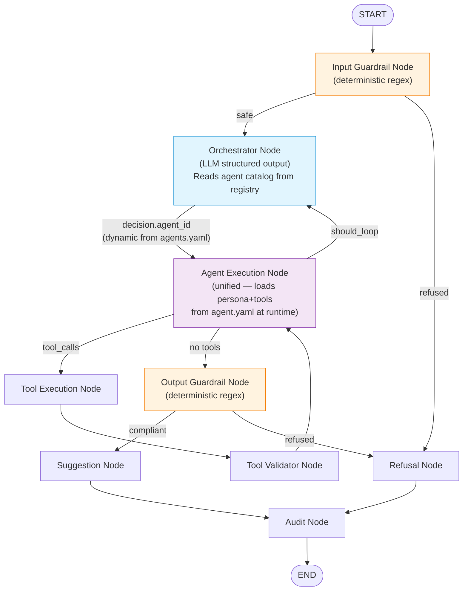
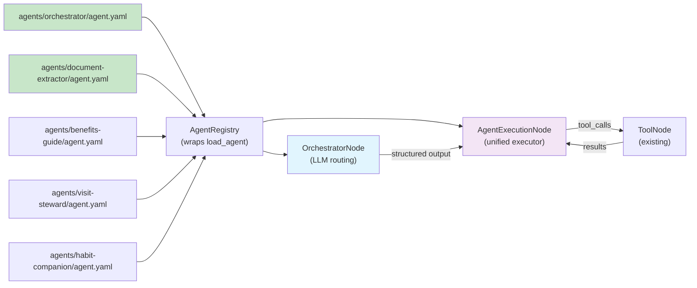

# Orchestrator & Agent Architecture Redesign (v2)

## What Already Exists

We have a well-structured agent convention that we should **build on, not replace**:

```
agents/
├── _template/
│   ├── agent.yaml          # Schema template
│   ├── starters.json       # Conversation starters
│   ├── evals/golden.jsonl   # Evaluation dataset
│   └── README.md
├── benefits-guide/
│   ├── agent.yaml
│   ├── starters.json
│   └── evals/golden.jsonl
├── visit-steward/
│   └── ...
└── habit-companion/
    └── ...
```

**Existing backend infrastructure:**
- [`AgentManifest`](file:///Users/bharatjoshi/git/carefold/backend/src/carefold/schemas/manifest.py#L34-L60) — Pydantic model with `id`, `title`, `tools`, `skills`, `forbidden`, `persona`, `risk_class`, `model`
- [`load_agent()`](file:///Users/bharatjoshi/git/carefold/backend/src/carefold/loaders/agent_loader.py#L63-L131) — Loads `agent.yaml`, resolves skills, computes `effective_tools = union(agent.tools, skill.tools)`
- [`load_all_agents()`](file:///Users/bharatjoshi/git/carefold/backend/src/carefold/loaders/agent_loader.py#L134-L193) — Discovers all agents in `agents/` dir
- [`PHASE_0_REGISTRY`](file:///Users/bharatjoshi/git/carefold/backend/src/carefold/schemas/manifest.py#L18) — `{attach-read, workspace-note, skill-docs}`
- [`BUNDLED_AGENT_IDS`](file:///Users/bharatjoshi/git/carefold/backend/src/carefold/constants/defaults.py#L98-L102) — `{visit-steward, benefits-guide, habit-companion}`
- API endpoints: `GET /api/agents`, `GET /api/agents/{agent_id}`

---

## What's Wrong Now

### 1. Supervisor uses regex, not the existing agent definitions
The [`SupervisorNode`](file:///Users/bharatjoshi/git/carefold/backend/src/carefold/workflows/nodes/supervisor_node.py) and [`supervisor.py`](file:///Users/bharatjoshi/git/carefold/backend/src/carefold/workflows/subgraphs/supervisor.py) have **their own hardcoded agent lists and regex patterns** that are completely disconnected from `agents/*/agent.yaml`:

```python
# supervisor_node.py — duplicates what agents/benefits-guide/agent.yaml already defines
_BENEFITS_PATTERNS = re.compile(r"\b(insurance|deductible|copay|...)
SPECIALIST_BENEFITS_GUIDE = "benefits-guide"
```

### 2. No orchestrator agent definition
There's no `agents/orchestrator/agent.yaml`. The orchestrator is just inline Python code.

### 3. No document-extractor agent definition
There's no `agents/document-extractor/agent.yaml`. Extraction is hand-rolled regex in `tool.py`.

### 4. `AgentManifest` missing orchestration fields
It has `tools` and `persona` but lacks `can_delegate` and `description` fields needed for dynamic routing.

### 5. Hardcoded values in extraction files
[`tool.py`](file:///Users/bharatjoshi/git/carefold/backend/src/carefold/workflows/subgraphs/extraction/tool.py), [`sanitizer.py`](file:///Users/bharatjoshi/git/carefold/backend/src/carefold/workflows/subgraphs/extraction/sanitizer.py), [`grounding.py`](file:///Users/bharatjoshi/git/carefold/backend/src/carefold/workflows/subgraphs/extraction/grounding.py) have hardcoded strings that should live in constants or YAML.

---

## The Plan

### Step 1: Add Missing Agent Folders

Create `agents/orchestrator/` and `agents/document-extractor/` following the existing convention:

```yaml
# agents/orchestrator/agent.yaml
id: orchestrator
title: Orchestrator
version: 0.1.0
license: Apache-2.0
risk_class: admin
model: llama3.2
can_delegate: true           # NEW field
max_iterations: 5             # NEW field
description: >-               # NEW field — used by UI and self-awareness
  General-purpose planning and routing agent. Analyzes user intent,
  selects the best specialist agent to handle the request, and
  coordinates multi-step workflows. Domain-agnostic.
skills: []
tools:
  - delegate_to_agent          # Meta-tool: invoke another agent
  - list_agents                # Meta-tool: discover available agents
forbidden:
  - diagnose
  - prescribe
  - dose
  - replace_emergency_care
  - instruct_stop_medication
persona: |
  You are the Orchestrator, a general-purpose planning and routing agent.
  You analyze the user's request and conversation context, then decide which
  specialist agent is best suited to handle it.

  You have access to a catalog of specialist agents. Use the list_agents tool
  to discover available agents and their capabilities. Use the delegate_to_agent
  tool to route the request to the chosen specialist.

  ROUTING GUIDELINES:
  - Examine the user's intent carefully. Consider the full conversation context.
  - Choose the single most appropriate specialist agent.
  - If the request is ambiguous, pick the closest match and explain your reasoning.
  - If the request requires multiple agents, handle them sequentially.
  - If no specialist fits, respond directly as a general assistant.

  OUTPUT: Always use the delegate_to_agent tool to route. Never answer
  domain-specific questions yourself — delegate to the specialist.
```

```yaml
# agents/document-extractor/agent.yaml
id: document-extractor
title: Document Extractor
version: 0.1.0
license: Apache-2.0
risk_class: admin
model: llama3.2
description: >-
  Document analysis and structured data extraction agent. Reads uploaded
  PDFs, text files, and tables. Extracts structured dossiers for insurance
  benefits, clinical visit notes, and generic documents. Sanitizes PII
  before processing. Validates extracted data against source text.
skills: []
tools:
  - attach-read
  - sanitize_pii
  - extract_structured_data
  - validate_grounding
forbidden:
  - diagnose
  - prescribe
  - dose
  - replace_emergency_care
  - instruct_stop_medication
persona: |
  You are Document Extractor, a data extraction specialist.
  When a user uploads a document or asks to extract structured data:

  1. Read the file using the attach-read tool.
  2. Sanitize PII using the sanitize_pii tool.
  3. Extract structured data using the extract_structured_data tool,
     selecting the appropriate schema (insurance, clinical, or generic).
  4. Validate numerical accuracy using the validate_grounding tool.
  5. Present the structured results to the user.

  Always sanitize PII before extraction. Always validate grounding after extraction.
  Report any ungrounded values transparently to the user.
```

### Step 2: Extend `AgentManifest` Schema

Add the new fields to [`AgentManifest`](file:///Users/bharatjoshi/git/carefold/backend/src/carefold/schemas/manifest.py#L34-L60):

```python
class AgentManifest(BaseModel):
    # ... existing fields ...
    can_delegate: bool = False              # NEW: can this agent invoke others?
    max_iterations: int = 3                 # NEW: ReAct loop cap
    description: str = ""                   # NEW: short description for catalog
```

### Step 3: Build `AgentRegistry` (wraps existing loader)

```python
# backend/src/carefold/agents/registry.py

class AgentRegistry:
    """Runtime registry wrapping load_all_agents() with catalog formatting."""

    def __init__(self, agents_dir: Path, skills_dir: Optional[Path] = None):
        self._agents: Dict[str, AgentManifest] = {}
        self._effective_tools: Dict[str, List[str]] = {}
        self._agents_dir = agents_dir
        self._skills_dir = skills_dir
        self._load()

    def _load(self):
        """Discovers agents using existing load_agent() infrastructure."""
        for entry in sorted(self._agents_dir.iterdir()):
            if entry.is_dir() and not entry.name.startswith((".", "_")):
                try:
                    manifest, effective_tools, _ = load_agent(entry, self._skills_dir)
                    self._agents[manifest.id] = manifest
                    self._effective_tools[manifest.id] = effective_tools
                except Exception as err:
                    logger.warning("Failed to load agent %s: %s", entry.name, err)

    def get(self, agent_id: str) -> Optional[AgentManifest]:
        return self._agents.get(agent_id)

    def list_agents(self) -> List[AgentManifest]:
        return list(self._agents.values())

    def get_delegatable_agents(self, exclude: str = "") -> List[AgentManifest]:
        """Returns non-orchestrator agents available for delegation."""
        return [a for a in self._agents.values()
                if a.id != exclude and not a.can_delegate]

    def format_agent_catalog(self, exclude: str = "orchestrator") -> str:
        """Formats agent catalog for the orchestrator's dynamic system prompt.
        
        Generates from live agent.yaml files — no hardcoding needed.
        """
        agents = self.get_delegatable_agents(exclude)
        lines = []
        for a in agents:
            # Description from agent.yaml 'description' field, fallback to first line of persona
            desc = a.description or _extract_first_line(a.persona)
            tools_str = ", ".join(self._effective_tools.get(a.id, []))
            lines.append(
                f"- **{a.id}** ({a.title}): {desc}\n"
                f"  Tools: [{tools_str}]"
            )
        return "\n".join(lines)
```

> [!IMPORTANT]
> `AgentRegistry` adds **zero new loading logic**. It wraps the existing [`load_agent()`](file:///Users/bharatjoshi/git/carefold/backend/src/carefold/loaders/agent_loader.py#L63-L131) that already handles YAML parsing, skill resolution, and tool union computation. The only new thing is `format_agent_catalog()` which generates the agent list dynamically for the orchestrator's prompt.

### Step 4: LLM-Driven `OrchestratorNode`

Replaces regex `SupervisorNode`. Uses `with_structured_output()` for reliable JSON routing:

```python
# backend/src/carefold/workflows/nodes/orchestrator_node.py

class OrchestratorDecision(BaseModel):
    """Structured output from the orchestrator LLM call."""
    agent_id: str = Field(description="ID of the agent to delegate to")
    reasoning: str = Field(description="Brief explanation of routing decision")
    instructions: str = Field(default="", description="Additional context for the agent")

class OrchestratorNode(BaseNode):
    """LLM-driven orchestrator that dynamically plans and routes to agents."""

    def __init__(self, model: BaseChatModel, registry: AgentRegistry, name: str = "orchestrator"):
        super().__init__(name=name)
        self.model = model
        self.registry = registry

    def _build_system_prompt(self, state: Dict[str, Any]) -> str:
        """Assembles orchestrator prompt with dynamic agent catalog."""
        catalog = self.registry.format_agent_catalog()
        # Load base prompt from prompts.yaml
        base_prompt = get_resource_loader().get_prompts().get("orchestrator", {}).get("system_prompt", "")
        return f"{base_prompt}\n\n## Available Agents:\n{catalog}"

    async def execute(self, state: Dict[str, Any]) -> Dict[str, Any]:
        # 1. Check for explicit routing (e.g., user selected agent in UI)
        explicit = state.get("routed_subgraph")
        if explicit and explicit != "orchestrator" and self.registry.get(explicit):
            return {
                "current_agent": explicit,
                "routed_subgraph": explicit,
                "orchestrator_reasoning": "Explicitly requested by user or system.",
                "next_step": explicit,
            }

        # 2. Build dynamic prompt with agent catalog
        system_prompt = self._build_system_prompt(state)
        messages = [SystemMessage(content=system_prompt)] + state.get("messages", [])

        # 3. LLM call with structured output
        structured_model = self.model.with_structured_output(OrchestratorDecision)
        decision = await structured_model.ainvoke(messages)

        # 4. Validate the chosen agent exists
        if not self.registry.get(decision.agent_id):
            # Fallback: pick the first available agent
            fallback = self.registry.get_delegatable_agents()[0]
            decision.agent_id = fallback.id
            decision.reasoning += f" (original choice not found, fell back to {fallback.id})"

        return {
            "current_agent": decision.agent_id,
            "routed_subgraph": decision.agent_id,
            "agent_id": decision.agent_id,
            "orchestrator_reasoning": decision.reasoning,
            "orchestrator_instructions": decision.instructions,
            "next_step": decision.agent_id,
        }
```

### Step 5: Unified `AgentExecutionNode`

One node handles **all** agents — loads persona/tools from the registry at runtime:

```python
# backend/src/carefold/workflows/nodes/agent_execution_node.py

class AgentExecutionNode(BaseNode):
    """Unified agent executor. Loads definition from registry, resolves tools, runs LLM."""

    def __init__(self, model: BaseChatModel, registry: AgentRegistry,
                 tool_registry: ToolRegistry, name: str = "agent_execution"):
        super().__init__(name=name)
        self.model = model
        self.registry = registry
        self.tool_registry = tool_registry

    async def execute(self, state: Dict[str, Any]) -> Dict[str, Any]:
        agent_id = state.get("current_agent") or state.get("agent_id")
        definition = self.registry.get(agent_id)

        if not definition:
            return {"error": f"Unknown agent: {agent_id}", "next_step": "error"}

        # 1. Resolve system prompt from agent.yaml persona
        persona = definition.persona if isinstance(definition.persona, str) \
                  else definition.persona.instructions or ""
        safety_preamble = get_resource_loader().get_safety_preamble_template().format(
            forbidden_str=", ".join(definition.forbidden)
        )
        system_prompt = f"{safety_preamble}\n\n{persona}"

        # 2. Resolve authorized tools from agent's effective tools
        effective_tool_names = self._effective_tools.get(agent_id, [])
        tools = self.tool_registry.resolve(effective_tool_names)

        # 3. Build messages and invoke
        messages = self._build_messages(system_prompt, state)
        bound_model = self.model.bind_tools(tools) if tools else self.model
        response = await bound_model.ainvoke(messages)

        tool_calls = getattr(response, "tool_calls", [])
        next_step = "tools" if tool_calls else "output_guardrail"

        return {
            "messages": [response],
            "output": response.content,
            "tool_calls": tool_calls,
            "current_agent": agent_id,
            "next_step": next_step,
        }
```

### Step 6: Document Extractor as an Agent with Tools

Instead of `_heuristic_dossier_extractor` (200+ lines of regex), the document extractor is **an agent that calls tools**:

```python
# backend/src/carefold/tools/extraction_tools.py

class SanitizePIITool(BaseTool):
    """Wraps sanitizer.py — regex stays for security."""
    name = "sanitize_pii"
    description = "Mask PII (SSN, MRN, phone, address) in text. Returns sanitized text."

    def _run(self, text: str) -> str:
        return sanitize_pii(text)

class ExtractStructuredDataTool(BaseTool):
    """LLM-based structured extraction into typed Pydantic dossiers."""
    name = "extract_structured_data"
    description = "Extract structured data from text into a typed schema (insurance, clinical, generic)."

    def __init__(self, model: BaseChatModel):
        self.model = model

    async def _arun(self, text: str, schema_type: str = "generic") -> dict:
        # Uses LLM with_structured_output to extract into Pydantic model
        dossier_cls = get_dossier_cls(schema_type)  # existing function
        extraction_prompt = get_resource_loader().get_prompts()["extraction"][schema_type]
        structured_model = self.model.with_structured_output(dossier_cls)
        result = await structured_model.ainvoke(
            [SystemMessage(content=extraction_prompt),
             HumanMessage(content=text)]
        )
        return result.to_dict()

class ValidateGroundingTool(BaseTool):
    """Wraps GroundingValidator — deterministic stays for correctness."""
    name = "validate_grounding"
    description = "Validate that extracted numerical values exist in source text."

    def _run(self, dossier: dict, source_text: str) -> dict:
        validator = GroundingValidator()
        result = validator.validate_dict(dossier, source_text)
        return result.model_dump()
```

The agent workflow (driven by the document-extractor's persona prompt, not code):
1. Agent calls `attach-read` → gets raw text
2. Agent calls `sanitize_pii` → gets sanitized text  
3. Agent calls `extract_structured_data` → gets typed dossier
4. Agent calls `validate_grounding` → gets validation report
5. Agent presents structured results to user

> [!NOTE]
> **PII sanitization stays deterministic regex** — wrapping it as a tool doesn't change the implementation, just makes it callable by the agent. Same for grounding validation. The only thing that becomes LLM-driven is the actual data extraction (replacing `_heuristic_dossier_extractor`).

### Step 7: Delegation Meta-Tools

Tools that let the orchestrator invoke other agents:

```python
# backend/src/carefold/tools/delegation_tools.py

class ListAgentsTool(BaseTool):
    """Returns the catalog of available specialist agents."""
    name = "list_agents"
    description = "List all available specialist agents and their capabilities."

    def __init__(self, registry: AgentRegistry):
        self.registry = registry

    def _run(self) -> str:
        return self.registry.format_agent_catalog()

class DelegateToAgentTool(BaseTool):
    """Routes the current request to a specialist agent."""
    name = "delegate_to_agent"
    description = "Delegate the user's request to a specialist agent by ID."

    def _run(self, agent_id: str, instructions: str = "") -> str:
        # This is a "routing" tool — execution is handled by the graph
        # The tool call signals the graph to route to this agent
        return json.dumps({"agent_id": agent_id, "instructions": instructions})
```

### Step 8: Update `PHASE_0_REGISTRY` and `BUNDLED_AGENT_IDS`

```python
# constants/defaults.py
BUNDLED_AGENT_IDS: FrozenSet[str] = frozenset({
    "orchestrator",          # NEW
    "visit-steward",
    "benefits-guide",
    "habit-companion",
    "document-extractor",    # NEW
})

# schemas/manifest.py
PHASE_0_REGISTRY = frozenset({
    "attach-read", "workspace-note", "skill-docs",
    "delegate_to_agent", "list_agents",              # NEW: delegation tools
    "sanitize_pii", "extract_structured_data",       # NEW: extraction tools
    "validate_grounding",                             # NEW: grounding tool
})
```

### Step 9: Extract Hardcoded Values

Move all remaining hardcoded strings from extraction files to constants/YAML:

| File | Hardcoded Value | Move To |
|------|----------------|---------|
| `tool.py` | `"document-extractor"` agent ID | `constants/agents.py` |
| `tool.py` | `"insurance"`, `"clinical"`, `"generic"` dossier types | `constants/extraction.py` |
| `subgraph.py` | `"sanitize"`, `"done"` next_step values | `constants/workflow_steps.py` |
| `sanitizer.py` | `"[SSN]"`, `"[MRN]"`, `"[PHONE]"`, etc. tags | Already constants — verify no duplication |
| `grounding.py` | Tolerance thresholds, format strings | `constants/extraction.py` |
| `supervisor.py` | All specialist IDs, regex patterns, fallback prompts | **DELETE** — replaced by registry |

---

## Revised LangGraph Topology



---

## What Gets Deleted

| File/Code | Why |
|-----------|-----|
| `workflows/nodes/supervisor_node.py` | Replaced by `orchestrator_node.py` |
| `workflows/subgraphs/supervisor.py` | Replaced by registry + orchestrator + unified executor |
| `tool.py::_heuristic_dossier_extractor()` | ~200 lines of regex parsing → replaced by LLM `extract_structured_data` tool |
| All `_BENEFITS_PATTERNS`, `_VISIT_PATTERNS`, etc. | No longer needed — orchestrator uses LLM |
| All `SPECIALIST_*` constants | Agent IDs come from `agents/*/agent.yaml` |
| `_create_specialist_node()` factory | Replaced by `AgentExecutionNode` |
| `_get_specialist_prompt()` hardcoded fallbacks | Persona comes from `agent.yaml` |

## What Stays (Deterministic)

| Component | Why It Stays Deterministic |
|-----------|--------------------------|
| PII sanitization regex (`sanitizer.py`) | Security-critical — can't depend on LLM |
| Grounding validation (`grounding.py`) | Correctness-critical — numerical verification |
| Input guardrail regex (`input_guardrail_node.py`) | Safety-critical — must catch dangerous queries |
| Output guardrail regex (`output_guardrail_node.py`) | Safety-critical — must catch unsafe responses |
| Refusal patterns (`refusal_patterns.yaml`) | Safety-critical — must not miss refusals |
| Dossier Pydantic schemas (`dossiers.py`) | Typing/validation — used as `structured_output` targets |

---

## Summary of Changes



> [!TIP]
> **Adding a new agent is now a 1-file operation:** Create `agents/my-new-agent/agent.yaml` with persona and tools. The orchestrator discovers it automatically via the registry. Zero Python code changes.
