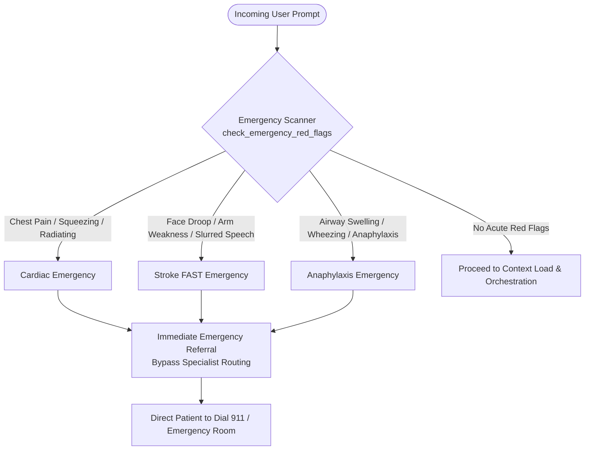

# Emergency Red Flags & Triage Protocol

Carefold prioritizes patient life safety above all operational goals. When acute, life-threatening symptoms are detected, the system immediately halts downstream multi-agent routing and provides direct, prominent emergency referral instructions.

---

## Acute Emergency Red-Flag Categories

The emergency detector (`backend/src/carefold/safety/emergency.py`) scans user inputs against three high-acuity symptom categories:



### 1. Acute Cardiac Symptoms (`CHEST_PATTERNS`)
- **Symptoms**: Crushing, squeezing, heavy chest pressure, chest tightness radiating to the left arm, jaw, neck, or back, especially accompanied by diaphoresis (cold sweats) or acute dyspnea.
- **Trigger Patterns**: Matches phrases such as `"crushing chest pain"`, `"chest pressure radiating to jaw"`, `"heart attack symptoms"`.

### 2. Stroke FAST Protocol (`STROKE_PATTERNS`)
- **Symptoms**: Signs aligned with the American Heart Association FAST standard:
  - **F**acial drooping or asymmetry.
  - **A**rm weakness, numbness, or inability to raise both arms.
  - **S**peech difficulty, slurred words, or inability to form coherent sentences.
  - **T**ime: Acute onset requiring immediate emergency transport.
- **Trigger Patterns**: Matches phrases such as `"face is drooping"`, `"slurred speech and arm numbness"`, `"sudden loss of vision in one eye"`.

### 3. Anaphylaxis & Airway Compromise (`ANAPHYLAXIS_PATTERNS`)
- **Symptoms**: Rapidly developing allergic reaction involving airway obstruction: swelling of the lips, tongue, or throat, stridor/wheezing, difficulty swallowing, or hives accompanied by lightheadedness.
- **Trigger Patterns**: Matches phrases such as `"throat is closing"`, `"tongue swelling after eating nuts"`, `"severe allergic reaction can't breathe"`.

---

## Negation and Context Handling

The emergency detector incorporates `NEGATION_PATTERNS` to differentiate active patient symptoms from family history or past events:

- Examples of non-emergencies:
  - *"My grandfather had a stroke ten years ago."*
  - *"I took a first-aid class on CPR for cardiac arrest."*

### Conservative Clinical Bias
In healthcare AI safety, **a false positive is vastly preferable to a false negative**. If an ambiguous query contains acute red-flag terminology with qualified negations (e.g. *"I don't think this chest pain is an emergency"*), Carefold deliberately errs on the side of caution and triggers an emergency alert.

---

## Emergency Execution Circuit Breaker

When an emergency flag is detected:
1. **Zero LLM Latency**: Downstream LLM inference is completely bypassed. The emergency response is emitted deterministically in under 5 milliseconds.
2. **SSE Refusal Event**: The backend emits an SSE `refusal` event containing reason `emergency_red_flag`.
3. **Emergency Directive Text**: The user interface displays a high-contrast emergency banner:

```
EMERGENCY ALERT: Your message describes symptoms that may indicate a medical emergency.
Please IMMEDIATELY call 911 (or your local emergency services number) or go to the nearest hospital emergency room.
Do not wait for a response or attempt to manage these symptoms with an online assistant.
```

---

## 47-Point Security Penetration Suite

Clinical safety in Carefold is fortified by a comprehensive automated penetration test suite (`backend/tests/penetration_suite.py`) containing 47 distinct test attacks:

- **Path Traversal Attacks**: Attempts to read `/etc/passwd`, Windows registry, or parent directories via `attach-read` (`../../../../etc/passwd`).
- **Null Byte Injections**: Malicious string terminations (`file.txt\0.pdf`).
- **Symlink Escapes**: Symbolic links created inside sandboxes targeting root filesystems.
- **Undeclared Skill Access**: Agents attempting to read reference documents belonging to skills they have not explicitly declared in `agent.yaml`.

All 47 penetration attacks are verified on every continuous integration run.
